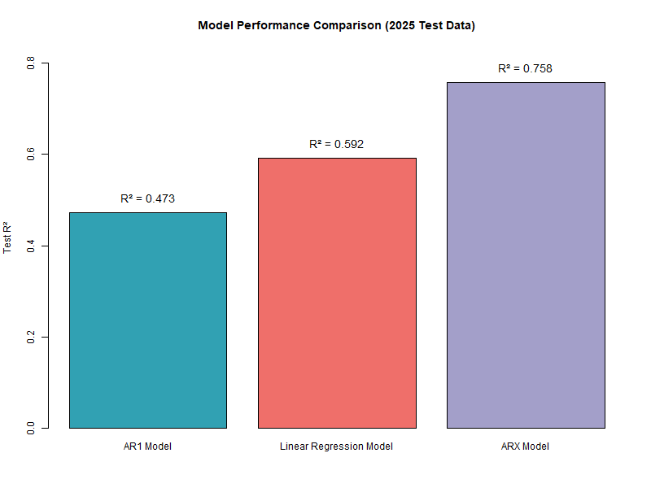
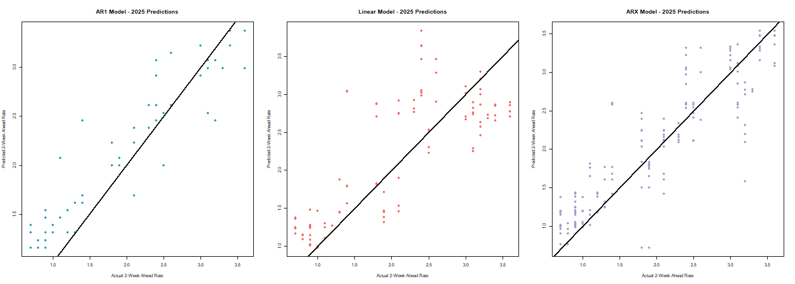

# COVID-19 Hospitalization Two Week Prediction in Georgia Using Wastewater Viral Activity 

Testing numerous models and their predictive power utilizing wastewater viral activity measurements in Georgia.

We have tested utilizing pure linear regression models and found that an ARX model currently performs the best against a basic autoregressive model and a model based on wastewater. A script was written to combine features in different permutations to decide the best-performing features for wastewater. The models were each trained on the 2023-2024 data and then tested against 2025.

Here are the models so far:

- Basic Autoregressive Model: $y_t = y_{t-2}$
- Wastewater-Only Model: $y_t = \beta_0 + \beta_1 w_t + \beta_2 \Delta w_{t-2} + \beta_3 \sin\left(\frac{2\pi t}{52}\right) + \beta_4 \cos\left(\frac{2\pi t}{52}\right) + \beta_5 \sigma_{2w} + \beta_6 \sigma_{3w} + \beta_7 \sigma_{4w} + \epsilon_t$
- ARX Model: $y_t = y_{t-2} + \beta_0 + \beta_1 w_t + \beta_2 \Delta w_{t-2} + \beta_3 \sin\left(\frac{2\pi t}{52}\right) + \beta_4 \cos\left(\frac{2\pi t}{52}\right) + \beta_5 \sigma_{2w} + \beta_6 \sigma_{3w} + \beta_7 \sigma_{4w} + \epsilon_t$

    where:
    - $y_t$ = hospitalization rate 2 weeks ahead
    - $w_t$ = current wastewater viral activity level
    - $\Delta w_{t-2} = w_t - w_{t-2}$ = 2-week change in wastewater
    - $\sin\left(\frac{2\pi t}{52}\right)$, $\cos\left(\frac{2\pi t}{52}\right)$ = seasonal features (week of year)
    - $\sigma_{2w}$, $\sigma_{3w}$, $\sigma_{4w}$ = volatility measures (standard deviation over 2, 3, and 4 weeks)

  Generally, the current wastewater level ($w_t$), the wastewater's seasonality as modelled by sine ($\sin\left(\frac{2\pi t}{52}\right)$), and the two week volatility measure ($\sigma_{2w}$) seem to have the most significant effects on the model besides the current hospitalization rate ($y_{t-2}$).

We have so far found that combining the wastewater + seasonal features with the autoregressive model to create an ARX model seems to perform the best and offer a significant increase in the predictiveness as measured by $R^2$ when compared to the basic autoregressive or wastewater-only models. More accurate two week predictions here would allow for hospitals to better manage their resources + simply plan more effectively in general.

## Comparison of Model Performances based on $R^2$

## Scatter Plots of All Models' Predictions vs. the Real Values

## Table of Accuracy Metrics
|Metric            |AR1_Model          |Linear_Model       |ARX_Model          |
|------------------|-------------------|-------------------|-------------------|
|RMSE_Training     |1.0625521132882927 |1.0455477841074403 |0.8465114019608968 |
|MAE_Training      |0.7520773759043111 |0.730141692075498  |0.5644948002613331 |
|R_squared_Training|0.7536756316515075 |0.7215234680059974 |0.8174564659399411 |
|RMSE_2025         |0.6752825853830517 |0.5890536426838424 |0.4542141778425064 |
|MAE_2025          |0.547925047871447  |0.47574726477695456|0.34075226708501055|
|R_squared_2025    |0.47328513314279563|0.592198040643308  |0.7575283384867237 |